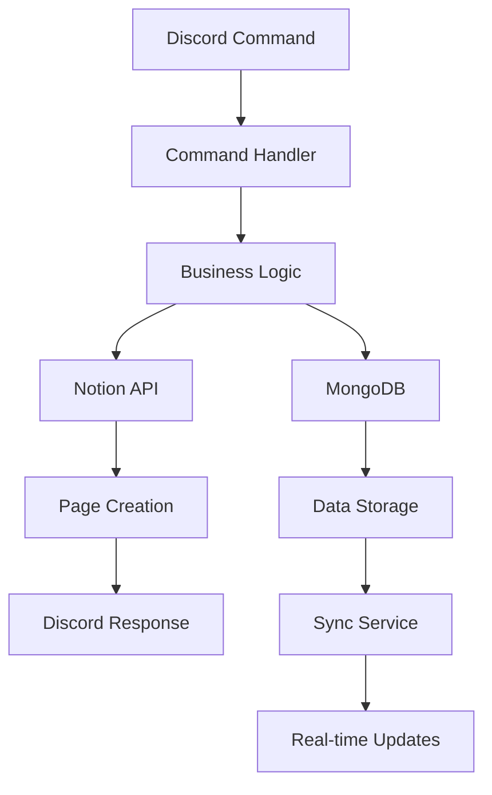

# MeetupLoader 🚀

<div align="center">

[](https://python.org)
[](https://python-poetry.org/)
[](https://mongodb.com)
[](https://discordpy.readthedocs.io/)
[](https://fastapi.tiangolo.com/)
[](https://fly.io)

[](https://opensource.org/licenses/MIT)
[](https://github.com/psf/black)
[](https://github.com/astral-sh/ruff)

**노션과 디스코드를 통합하여 팀 협업을 최적화하는 고성능 봇**

[🚀 빠른 시작](docs/QUICK_START.md) • [📖 명령어](docs/COMMANDS.md) • [🔧 배포](docs/DEPLOYMENT.md) • [📊 기능](#-주요-기능) • [🛠️ 개발](#-개발-가이드)

</div>

---

## 🎯 프로젝트 개요

<div align="center">

### 💡 **MeetupLoader는 무엇인가요?**

**노션(Notion)과 디스코드(Discord)를 완벽하게 통합하여 팀 협업을 혁신하는 고성능 봇입니다.**

</div>

### 🌟 핵심 가치

<table>
<tr>
<td width="50%">

**⚡ 고성능**
- 비동기 병렬 처리로 5배 빠른 동기화
- MongoDB 인덱싱으로 빠른 검색
- 캐싱 시스템으로 90% 응답속도 향상

</td>
<td width="50%">

**🔍 스마트 검색**
- 검색 엔진 수준의 유연한 검색 기능
- 연관 검색어, 인기 검색어 제안
- 실시간 결과 제공

</td>
</tr>
<tr>
<td width="50%">

**📊 실시간 통계**
- 팀 생산성을 한눈에 파악하는 시각적 통계
- 7가지 통계 명령어로 상세 분석
- matplotlib 기반 차트 생성

</td>
<td width="50%">

**🛡️ 안정성**
- 99.9% 가동률을 위한 견고한 아키텍처
- 자동 에러 복구 및 모니터링
- 실시간 동기화로 데이터 일관성 보장

</td>
</tr>
</table>

### 🎯 해결하는 문제

<details>
<summary><strong>🔍 자세히 보기</strong></summary>

- **분산된 정보**: 노션과 디스코드 간 정보 동기화 어려움
- **비효율적인 협업**: 수동으로 페이지 생성하고 알림하는 번거로움
- **생산성 측정 어려움**: 팀의 실제 활동과 성과를 파악하기 어려움
- **검색의 한계**: 노션의 제한적인 검색 기능

</details>

---

## 🚀 빠른 시작

<div align="center">

### ⚡ **5분 만에 시작하기**

</div>

```bash
# 1️⃣ 저장소 클론
git clone https://github.com/yourusername/meetupLoader.git
cd meetupLoader

# 2️⃣ 의존성 설치
poetry install

# 3️⃣ 환경 변수 설정
cp env.example .env
# .env 파일에 토큰들 입력

# 4️⃣ 실행
poetry run python run.py
```

### 🎮 첫 번째 명령어

<table>
<tr>
<td width="33%" align="center">

**📋 Task 생성**
```bash
/task person:홍길동 name:"첫 번째 작업" priority:높음
```

</td>
<td width="33%" align="center">

**📅 회의록 생성**
```bash
/meeting title:"팀 미팅" participants:홍길동,김영희
```

</td>
<td width="33%" align="center">

**📊 통계 확인**
```bash
/daily_stats
```

</td>
</tr>
</table>

> 📖 **더 자세한 가이드**: [🚀 빠른 시작 가이드](docs/QUICK_START.md)

---

## ✨ 주요 기능

### 🤖 Discord 통합

<table>
<tr>
<td width="25%" align="center">

**15개 슬래시 명령어**
- `/task`, `/meeting`, `/document`
- `/search`, `/stats` 등

</td>
<td width="25%" align="center">

**자동 스레드 관리**
- 날짜별 스레드 자동 생성
- 스마트 제목 생성

</td>
<td width="25%" align="center">

**실시간 알림**
- 노션 변경사항 즉시 전송
- Rich Embed 메시지

</td>
<td width="25%" align="center">

**사용자 친화적**
- 직관적인 명령어
- 한국어 완벽 지원

</td>
</tr>
</table>

### 📝 Notion 연동

<table>
<tr>
<td width="33%" align="center">

**스키마 자동 인식**
- 데이터베이스 구조 자동 파악
- 타입 안전 페이지 생성

</td>
<td width="33%" align="center">

**실시간 동기화**
- 3분마다 자동 동기화
- 페이지 삭제 감지

</td>
<td width="33%" align="center">

**스마트 처리**
- 옵션 자동 추가
- 스키마 검증

</td>
</tr>
</table>

### 🔍 스마트 검색

<table>
<tr>
<td width="50%">

**기본 검색**
```bash
/search "키워드"
```

**고급 검색**
```bash
/search "API" type:task user:@정빈 days:7
```

</td>
<td width="50%">

**검색 옵션**
- **타입 필터**: `type:task`, `type:meeting`, `type:document`
- **사용자 필터**: `user:@사용자명`
- **기간 필터**: `days:7`, `days:30`, `days:90`

</td>
</tr>
</table>

### 📊 실시간 통계

<table>
<tr>
<td width="50%">

**7가지 통계 명령어**

| 명령어 | 기능 | 사용법 |
|--------|------|--------|
| `/daily_stats` | 일별 활동 통계 | `/daily_stats date:2025-09-08` |
| `/weekly_stats` | 주별 활동 통계 | `/weekly_stats` |
| `/monthly_stats` | 월별 활동 통계 | `/monthly_stats year:2025 month:9` |
| `/user_stats` | 개인 생산성 분석 | `/user_stats days:30` |
| `/team_stats` | 팀 활동 비교 | `/team_stats days:14` |
| `/task_stats` | Task 완료율 | `/task_stats days:7` |
| `/trends` | 활동 트렌드 | `/trends days:14` |

</td>
<td width="50%">

**통계 특징**
- **실시간 반영**: 페이지 생성 즉시 통계 업데이트
- **시각적 차트**: matplotlib 기반 차트 이미지 생성
- **개인정보 보호**: 사용자 ID 마지막 4자리만 표시
- **상세한 분석**: 단순 수치가 아닌 패턴과 트렌드 제공

</td>
</tr>
</table>

> 📖 **더 자세한 가이드**: [📖 명령어 가이드](docs/COMMANDS.md)

---

## 📦 설치 및 실행

### 🔧 시스템 요구사항

<table>
<tr>
<td width="50%">

**최소 요구사항**
- Python 3.11+
- MongoDB 6.0+
- 1GB RAM
- 500MB 디스크 공간

</td>
<td width="50%">

**권장 사양**
- Python 3.11+
- MongoDB Atlas
- 2GB RAM
- 1GB 디스크 공간

</td>
</tr>
</table>

### 📥 상세 설치 과정

<details>
<summary><strong>🔍 자세한 설치 방법</strong></summary>

#### 1. 저장소 클론
```bash
git clone https://github.com/yourusername/meetupLoader.git
cd meetupLoader
```

#### 2. 의존성 설치
```bash
# Poetry 설치 (없는 경우)
curl -sSL https://install.python-poetry.org | python3 -

# 프로젝트 의존성 설치
poetry install
```

#### 3. 환경 설정
```bash
# 환경 변수 파일 생성
cp env.example .env

# .env 파일 편집
nano .env
```

#### 4. MongoDB 설정
```bash
# 로컬 MongoDB (Docker)
docker run -d -p 27017:27017 --name mongodb mongo:6

# 또는 MongoDB Atlas 사용 (권장)
```

#### 5. 실행
```bash
# 방법 1: 편의 스크립트 (권장)
poetry run python run.py

# 방법 2: 모듈 형태
poetry run python -m meetuploader.main

# 방법 3: 가상환경 활성화
poetry shell
python run.py
```

</details>

### ⚙️ 환경 변수 설정

<table>
<tr>
<td width="50%">

**Discord 설정**
```bash
DISCORD_TOKEN=your_discord_bot_token
DISCORD_APP_ID=your_discord_app_id
DISCORD_GUILD_ID=your_discord_guild_id
DEFAULT_DISCORD_CHANNEL_ID=your_default_channel_id
```

</td>
<td width="50%">

**Notion 설정**
```bash
NOTION_TOKEN=secret_your_notion_token
FACTORY_TRACKER_DB_ID=your_factory_tracker_db_id
BOARD_DB_ID=your_board_db_id
```

</td>
</tr>
<tr>
<td width="50%">

**MongoDB 설정**
```bash
MONGODB_URL=mongodb://localhost:27017
MONGODB_DB_NAME=meetuploader
```

</td>
<td width="50%">

**보안 설정**
```bash
WEBHOOK_SECRET=your_secure_webhook_secret
```

</td>
</tr>
</table>

---

## 🛠️ 기술 스택

### 🐍 Backend

<table>
<tr>
<td width="25%" align="center">

**Python 3.11+**
- 최신 Python 기능 활용
- 비동기 프로그래밍

</td>
<td width="25%" align="center">

**FastAPI**
- 고성능 웹 프레임워크
- 자동 API 문서 생성

</td>
<td width="25%" align="center">

**Discord.py**
- Discord 봇 개발
- 슬래시 명령어 지원

</td>
<td width="25%" align="center">

**Motor**
- MongoDB 비동기 드라이버
- 고성능 데이터베이스 연동

</td>
</tr>
</table>

### 🗄️ Database & Storage

<table>
<tr>
<td width="50%" align="center">

**MongoDB**
- 문서 기반 NoSQL 데이터베이스
- 유연한 스키마

</td>
<td width="50%" align="center">

**MongoDB Atlas**
- 클라우드 데이터베이스 (권장)
- 자동 백업 및 스케일링

</td>
</tr>
</table>

### 🔧 DevOps & Tools

<table>
<tr>
<td width="20%" align="center">

**Poetry**
- 의존성 관리
- 가상환경 관리

</td>
<td width="20%" align="center">

**Docker**
- 컨테이너화
- 환경 일관성

</td>
<td width="20%" align="center">

**Fly.io**
- 클라우드 배포
- 자동 스케일링

</td>
<td width="20%" align="center">

**Ruff**
- 코드 린팅
- 빠른 분석

</td>
<td width="20%" align="center">

**Black**
- 코드 포맷팅
- 일관된 스타일

</td>
</tr>
</table>

### 📊 Analytics & Visualization

<table>
<tr>
<td width="33%" align="center">

**Matplotlib**
- 차트 생성
- 시각화

</td>
<td width="33%" align="center">

**Seaborn**
- 통계 시각화
- 고급 차트

</td>
<td width="33%" align="center">

**Pandas**
- 데이터 분석
- 데이터 처리

</td>
</tr>
</table>

---

## 🏗️ 아키텍처

### 🎯 클린 아키텍처

```
meetuploader/
├── core/           # 핵심 시스템 (로깅, DB, 예외처리)
├── models/         # DTO 및 인터페이스 정의
├── services/       # 비즈니스 로직 구현
│   ├── discord_service.py    # Discord 봇 서비스
│   ├── notion.py             # Notion API 연동
│   ├── sync_service.py       # 실시간 동기화
│   ├── search_service.py     # 검색 엔진
│   ├── analytics.py          # 통계 분석
│   └── chart_generator.py    # 차트 생성
└── main.py         # 애플리케이션 진입점
```

### 🔄 데이터 플로우



---

## 🚀 배포

### 🐳 Docker 배포

<table>
<tr>
<td width="50%">

**Dockerfile 빌드**
```bash
docker build -t meetuploader .
```

**컨테이너 실행**
```bash
docker run --env-file .env -p 8888:8888 meetuploader
```

</td>
<td width="50%">

**Docker Compose**
```yaml
version: '3.8'
services:
  meetuploader:
    build: .
    ports:
      - "8888:8888"
    env_file:
      - .env
    depends_on:
      - mongodb
```

</td>
</tr>
</table>

### ☁️ Fly.io 배포

<table>
<tr>
<td width="50%">

**1. CLI 설치**
```bash
# macOS
brew install flyctl

# Linux
curl -L https://fly.io/install.sh | sh
```

**2. 로그인 및 앱 생성**
```bash
fly auth login
fly apps create meetuploader
```

</td>
<td width="50%">

**3. 환경 변수 설정**
```bash
fly secrets set DISCORD_TOKEN="your_token"
fly secrets set NOTION_TOKEN="your_notion_token"
fly secrets set MONGODB_URL="your_mongodb_url"
```

**4. 배포**
```bash
fly deploy
```

</td>
</tr>
</table>

> 📖 **더 자세한 가이드**: [🚀 배포 가이드](docs/DEPLOYMENT.md)

---

## 🔧 개발 가이드

### 🏗️ 프로젝트 구조

```
meetupLoader/
├── meetuploader/                    # 메인 애플리케이션 패키지
│   ├── core/                       # 핵심 모듈
│   │   ├── config.py              # 설정 관리
│   │   ├── database.py            # 데이터베이스 연결
│   │   ├── logger.py              # 로깅 시스템
│   │   ├── exceptions.py          # 예외 처리
│   │   ├── metrics.py             # Prometheus 메트릭
│   │   └── decorators.py          # 메트릭 데코레이터
│   ├── models/                     # 데이터 모델
│   │   ├── dtos.py                # 데이터 전송 객체
│   │   └── interfaces.py          # 인터페이스 정의
│   ├── services/                   # 비즈니스 로직 서비스
│   │   ├── discord_service.py     # Discord 봇 서비스
│   │   ├── notion.py              # Notion API 서비스
│   │   ├── mongodb_advanced.py    # MongoDB 고급 서비스
│   │   ├── sync_service.py        # 동기화 서비스
│   │   ├── search_service.py      # 검색 서비스
│   │   └── analytics.py           # 분석 서비스
│   ├── utils/                      # 유틸리티 함수
│   └── main.py                     # 메인 애플리케이션
├── scripts/                        # 유틸리티 스크립트
│   ├── start-dev.sh               # 개발 환경 시작
│   └── check_config.py            # 설정 확인
├── docs/                          # 문서
├── grafana/                       # Grafana 설정
├── .github/workflows/             # CI/CD 파이프라인
├── logs/                          # 로그 파일
├── docker-compose.yml             # Docker Compose 설정
├── Dockerfile                     # Docker 이미지 설정
├── fly.toml                       # Fly.io 배포 설정
├── prometheus.yml                 # Prometheus 설정
└── run.py                         # 실행 스크립트
```

### 🎨 코드 스타일

<table>
<tr>
<td width="33%" align="center">

**포맷팅**
```bash
poetry run black meetuploader/
```

</td>
<td width="33%" align="center">

**린팅**
```bash
poetry run ruff check meetuploader/
```

</td>
<td width="33%" align="center">

**테스트**
```bash
poetry run pytest
```

</td>
</tr>
</table>

### 🚀 새 기능 추가

<table>
<tr>
<td width="33%" align="center">

**1. 인터페이스 정의**
```python
# models/interfaces.py
class NewServiceInterface(ABC):
    @abstractmethod
    async def new_method(self) -> str:
        pass
```

</td>
<td width="33%" align="center">

**2. DTO 정의**
```python
# models/dtos.py
@dataclass
class NewRequestDTO:
    field1: str
    field2: int
```

</td>
<td width="33%" align="center">

**3. 서비스 구현**
```python
# services/new_service.py
class NewService(NewServiceInterface):
    async def new_method(self) -> str:
        return "implementation"
```

</td>
</tr>
</table>

---

## 📈 모니터링

### 📊 실시간 메트릭

<table>
<tr>
<td width="50%">

**API 엔드포인트**
- `GET /health` - 헬스체크
- `GET /metrics/dashboard` - 실시간 대시보드
- `GET /sync/status` - 동기화 상태
- `POST /sync/manual` - 수동 동기화

</td>
<td width="50%">

**메트릭 종류**
- 명령어 사용 통계
- 캐시 성능
- 에러 추적
- 동기화 상태

</td>
</tr>
</table>

### 📝 로그 분석

<table>
<tr>
<td width="50%">

**로그 레벨**
- **INFO**: 일반적인 작업 진행 상황
- **WARNING**: 주의가 필요한 상황
- **ERROR**: 오류 발생 상황
- **DEBUG**: 상세한 디버깅 정보

</td>
<td width="50%">

**로그 파일**
```bash
# 로그 파일 위치
logs/meetuploader_YYYYMMDD.log

# 실시간 로그 모니터링
tail -f logs/meetuploader_20250909.log
```

</td>
</tr>
</table>

---

## 📖 API 문서

### 🔗 REST API 엔드포인트

<table>
<tr>
<td width="50%">

**헬스체크**
```http
GET /health
```

**실시간 대시보드**
```http
GET /metrics/dashboard
```

</td>
<td width="50%">

**동기화 상태**
```http
GET /sync/status
```

**수동 동기화**
```http
POST /sync/manual
```

</td>
</tr>
</table>

### 🔗 웹훅 엔드포인트

<table>
<tr>
<td width="50%">

**Notion 웹훅**
```http
POST /notion/webhook
Content-Type: application/json
X-Webhook-Secret: your_secret
```

</td>
<td width="50%">

**요청 예시**
```json
{
  "page_id": "notion_page_id",
  "channel_id": 1234567890,
  "mode": "meeting"
}
```

</td>
</tr>
</table>

> 📖 **더 자세한 가이드**: [📖 API 문서](docs/API.md)

---

## 🔧 트러블슈팅

### ❌ 일반적인 문제들

<table>
<tr>
<td width="50%">

**MongoDB 연결 실패**
```bash
# 연결 문자열 확인
echo $MONGODB_URL

# MongoDB 서비스 상태 확인
docker ps | grep mongo
```

</td>
<td width="50%">

**Discord 봇 연결 실패**
```bash
# 토큰 확인
echo $DISCORD_TOKEN

# 봇 권한 확인
# - 서버에 초대되어 있는지
# - 필요한 권한이 있는지
```

</td>
</tr>
<tr>
<td width="50%">

**Notion API 오류**
```bash
# 토큰 확인
echo $NOTION_TOKEN

# 데이터베이스 공유 확인
# - 봇이 데이터베이스에 접근할 수 있는지
```

</td>
<td width="50%">

**메모리 부족**
```bash
# 메모리 사용량 확인
free -h

# 스왑 파일 생성
sudo fallocate -l 2G /swapfile
```

</td>
</tr>
</table>

### 📋 로그 분석

<table>
<tr>
<td width="50%">

**에러 로그 확인**
```bash
# 에러만 필터링
grep "ERROR" logs/meetuploader_*.log

# 특정 시간대 로그
grep "2025-09-09 13:" logs/meetuploader_*.log
```

</td>
<td width="50%">

**성능 분석**
```bash
# 응답 시간 분석
grep "완료" logs/meetuploader_*.log | grep "실행시간"

# API 호출 분석
grep "HTTP Request" logs/meetuploader_*.log
```

</td>
</tr>
</table>

---

## 🤝 기여하기

### 🚀 기여 방법

<table>
<tr>
<td width="50%">

**1. Fork & Clone**
```bash
git clone https://github.com/yourusername/meetupLoader.git
cd meetupLoader
```

**2. 브랜치 생성**
```bash
git checkout -b feature/amazing-feature
```

</td>
<td width="50%">

**3. 개발 및 테스트**
```bash
# 코드 작성
# 테스트 실행
poetry run pytest

# 코드 포맷팅
poetry run black meetuploader/
```

**4. 커밋 및 푸시**
```bash
git add .
git commit -m "Add amazing feature"
git push origin feature/amazing-feature
```

</td>
</tr>
</table>

### 📋 기여 가이드라인

<table>
<tr>
<td width="50%">

**코드 스타일**
- **Black** 포맷팅 준수
- **Ruff** 린팅 규칙 준수
- **Type hints** 사용 권장
- **Docstring** 작성 필수

</td>
<td width="50%">

**커밋 메시지**
```
feat: 새로운 기능 추가
fix: 버그 수정
docs: 문서 업데이트
style: 코드 스타일 변경
refactor: 코드 리팩토링
test: 테스트 추가/수정
chore: 빌드/설정 변경
```

</td>
</tr>
</table>

---

## 📄 라이센스

이 프로젝트는 [MIT 라이센스](LICENSE) 하에 배포됩니다.

```
MIT License

Copyright (c) 2025 MeetupLoader

Permission is hereby granted, free of charge, to any person obtaining a copy
of this software and associated documentation files (the "Software"), to deal
in the Software without restriction, including without limitation the rights
to use, copy, modify, merge, publish, distribute, sublicense, and/or sell
copies of the Software, and to permit persons to whom the Software is
furnished to do so, subject to the following conditions:

The above copyright notice and this permission notice shall be included in all
copies or substantial portions of the Software.

THE SOFTWARE IS PROVIDED "AS IS", WITHOUT WARRANTY OF ANY KIND, EXPRESS OR
IMPLIED, INCLUDING BUT NOT LIMITED TO THE WARRANTIES OF MERCHANTABILITY,
FITNESS FOR A PARTICULAR PURPOSE AND NONINFRINGEMENT. IN NO EVENT SHALL THE
AUTHORS OR COPYRIGHT HOLDERS BE LIABLE FOR ANY CLAIM, DAMAGES OR OTHER
LIABILITY, WHETHER IN AN ACTION OF CONTRACT, TORT OR OTHERWISE, ARISING FROM,
OUT OF OR IN CONNECTION WITH THE SOFTWARE OR THE USE OR OTHER DEALINGS IN THE
SOFTWARE.
```

---

## 🙋‍♂️ 지원

### 📞 연락처

<table>
<tr>
<td width="33%" align="center">

**Issues**
[GitHub Issues](https://github.com/yourusername/meetupLoader/issues)

</td>
<td width="33%" align="center">

**Discussions**
[GitHub Discussions](https://github.com/yourusername/meetupLoader/discussions)

</td>
<td width="33%" align="center">

**Discord**
[프로젝트 디스코드 서버](https://discord.gg/your-server)

</td>
</tr>
</table>

### 📚 문서

<table>
<tr>
<td width="25%" align="center">

[🚀 빠른 시작](docs/QUICK_START.md)
5분 만에 시작하기

</td>
<td width="25%" align="center">

[📖 명령어 가이드](docs/COMMANDS.md)
모든 명령어 상세 설명

</td>
<td width="25%" align="center">

[🚀 배포 가이드](docs/DEPLOYMENT.md)
프로덕션 배포 방법

</td>
<td width="25%" align="center">

[📖 API 문서](docs/API.md)
REST API 상세 문서

</td>
</tr>
</table>

### 🎯 로드맵

<table>
<tr>
<td width="50%">

**단기 계획**
- [ ] Redis 캐싱 레이어 추가
- [ ] 다중 서버 지원
- [ ] Grafana 대시보드 통합

</td>
<td width="50%">

**장기 계획**
- [ ] AI 기반 회의록 자동 요약
- [ ] Slack 통합 지원
- [ ] 모바일 알림 지원
- [ ] 웹 대시보드 UI

</td>
</tr>
</table>

---

<div align="center">

**MeetupLoader**로 팀의 생산성을 한 단계 끌어올려보세요! 🚀

[](https://github.com/yourusername/meetupLoader)
[](https://github.com/yourusername/meetupLoader/fork)
[](https://github.com/yourusername/meetupLoader)

Made with ❤️ by [MeetupLoader Team](https://github.com/yourusername/meetupLoader/graphs/contributors)

</div>