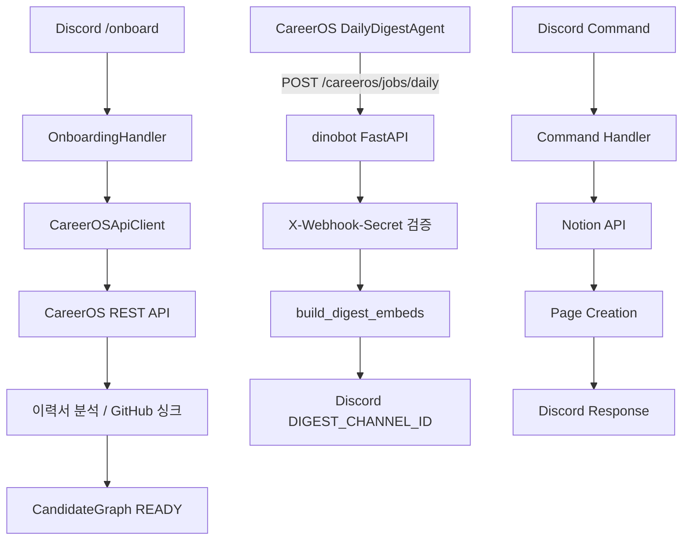

# DinoBot

[](https://python.org)
[](https://fastapi.tiangolo.com/)
[](https://discordpy.readthedocs.io/)
[](https://mongodb.com)
[](https://fly.io)
[](https://opensource.org/licenses/MIT)

Discord career bot (CareerOS integration) + Notion–Discord collaboration automation bot.

---

## Portfolio Ecosystem

dinobot은 동일 개발자가 구성한 3개 프로젝트 포트폴리오의 알림 레이어입니다.

| 프로젝트 | 역할 | 스택 |
|---------|------|------|
| **[beanllm](https://github.com/leebeanbin/beanllm)** | AI 인프라 — 8개 LLM 프로바이더 통합 라이브러리 (PyPI) | Python · 6,340 tests |
| **[careerOS](https://github.com/leebeanbin/careerOS)** | 커리어 AI 플랫폼 백엔드 | Spring Boot 3.3 · 415 tests |
| **dinobot** ← (this repo) | Discord 커리어 봇 + Notion 협업 봇 | Python · FastAPI · Discord.py |

**연결 방식:**
- careerOS `DailyDigestAgent` → `POST /careeros/jobs/daily` 웹훅 전송 (매일 08:00 UTC)
- dinobot 온보딩(`/onboard`) → careerOS REST API로 이력서·GitHub 연동 요청
- dinobot `/career` → careerOS CandidateGraph 상태 실시간 조회

---

## 개요

FastAPI HTTP 서버와 Discord.py 봇을 **단일 asyncio 이벤트 루프**에서 실행하는 Python 봇. IPC 없이 두 서비스가 메모리를 직접 공유한다 (설계 배경: [ADR-001](docs/adr/ADR-001-fastapi-discord-hybrid.md)).

**두 가지 역할:**

| 역할 | 동작 |
|------|------|
| **CareerOS 커리어 봇** | 온보딩(`/onboard`), 이력서·GitHub 연동, 일일 채용 공고 다이제스트 수신(08:00 UTC 웹훅) |
| **Notion–Discord 협업 봇** | Task·회의록·문서 슬래시 커맨드, Notion ↔ MongoDB 동기화, 7가지 통계 명령어 |

---

## 데이터 플로우


```mermaid
graph TD
    A[Discord /onboard] --> B[OnboardingHandler]
    B --> C[CareerOSApiClient]
    C --> D[CareerOS REST API]
    D --> E[이력서 분석 / GitHub 싱크]
    E --> F[CandidateGraph READY]

    G[CareerOS DailyDigestAgent] -->|POST /careeros/jobs/daily| H[dinobot FastAPI]
    H --> I[X-Webhook-Secret 검증]
    I --> J[build_digest_embeds]
    J --> K[Discord DIGEST_CHANNEL_ID]

    L[Discord Command] --> M[Command Handler]
    M --> N[Notion API]
    N --> O[Page Creation]
    O --> P[Discord Response]
```

---

## 주요 명령어

| 명령어 | 설명 |
|--------|------|
| `/onboard` | 커리어 목표 · 이력서 · GitHub 연동 온보딩 |
| `/career` | CareerOS CandidateGraph 상태 조회 |
| `/task` | Notion Task 생성 |
| `/meeting` | 회의록 생성 |
| `/document` | 문서 페이지 생성 |
| `/search` | Notion 전체 검색 (타입·사용자·기간 필터) |
| `/daily_stats` | 일별 팀 통계 |

---

## 빠른 시작

```bash
git clone https://github.com/leebeanbin/dinobot.git
cd dinobot
poetry install
cp env.example .env   # 환경변수 입력
poetry run python run.py
```

---

## 문서

| | |
|--|--|
| [아키텍처](wiki/architecture.md) | 단일 asyncio 이벤트 루프 설계, 컴포넌트 다이어그램 |
| [온보딩 플로우](wiki/onboarding.md) | 사용자 온보딩 상태 머신 |
| [CareerOS 연동](wiki/careeros.md) | 웹훅·REST API 통합 상세 |
| [ADR](docs/adr/) | 아키텍처 결정 기록 |
| [빠른 시작](docs/QUICK_START.md) | 환경변수, 배포(Docker / Fly.io) |
| [명령어 레퍼런스](docs/COMMANDS.md) | 전체 슬래시 커맨드 목록 |
