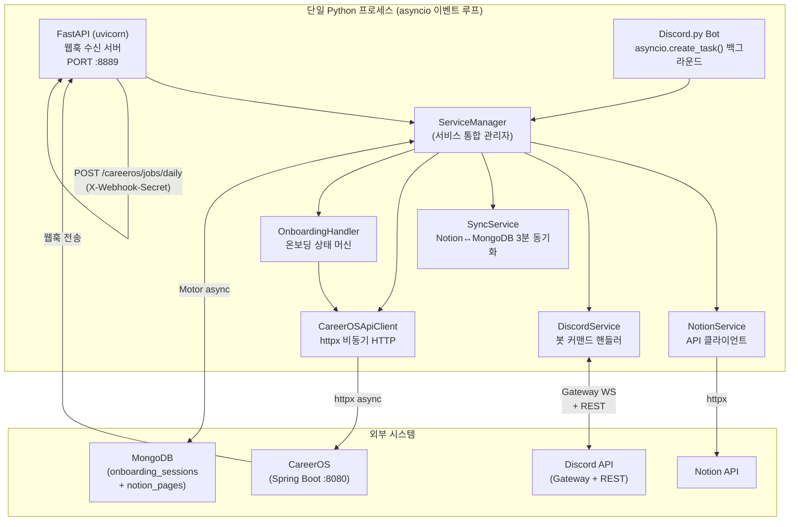
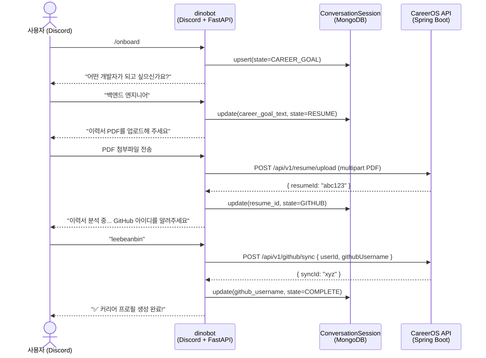
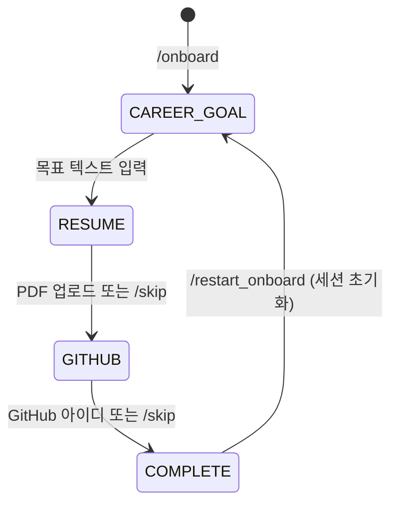
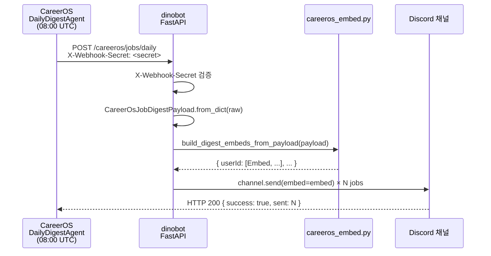

# dinobot 시스템 아키텍처

dinobot은 두 가지 역할을 하나의 프로세스에서 수행합니다:
1. **CareerOS 연동 봇** — 취업 준비 온보딩 + 일일 공고 다이제스트 전달
2. **Notion–Discord 협업 봇** — 태스크/회의록 생성, 검색, 통계

---

## 시스템 컴포넌트 다이어그램



---

## 모듈 책임 테이블

| 경로 | 역할 |
|------|------|
| `main.py :: ServiceManager` | FastAPI 앱 + Discord 봇 통합 초기화, 라우트 등록, 워크플로우 디스패치 |
| `src/service/careeros/careeros_api_client.py` | CareerOS REST API 호출 (이력서 업로드, GitHub sync 트리거, 그래프 조회) |
| `src/conversation/onboarding_handler.py` | 온보딩 상태 머신 — 메시지 라우팅, 상태 전이 |
| `src/conversation/state.py` | `ConversationSession` DTO + MongoDB upsert/get/delete |
| `src/conversation/file_upload_handler.py` | Discord 첨부파일(PDF) 다운로드 → CareerOS 업로드 |
| `src/embeds/careeros_embed.py` | `CareerOsJobDigestPayload` → `discord.Embed` 변환 |
| `src/service/notion/` | Notion DB 페이지 CRUD (task/meeting/document) |
| `src/service/sync/sync_service.py` | Notion ↔ MongoDB 실시간 동기화 (3분 주기) |
| `src/service/analytics/` | Prometheus 메트릭, MongoDB 성능 분석, 통계 차트 |
| `mcp_server/careeros_tools.py` | FastAPI MCP 라우터 (`/mcp/careeros/*`) |

---

## FastAPI + Discord 동시 실행 패턴

```python
# main.py :: run_service()
async def run_service(self):
    # Discord 봇 → asyncio 백그라운드 태스크
    bot_task = asyncio.create_task(
        self.discord_service.bot.start(settings.discord_token)
    )
    # FastAPI uvicorn → 메인 서버 (이벤트 루프 점유)
    server = uvicorn.Server(uvicorn.Config(app=self.web_application, ...))
    await server.serve()
```

두 서비스가 **동일한 asyncio 이벤트 루프**에서 실행됩니다. (→ [ADR-001](../adr/ADR-001-fastapi-discord-hybrid.md))

---

## CareerOS 온보딩 플로우



### 온보딩 상태 머신



**`ConversationSession` 필드:**
| 필드 | 타입 | 설명 |
|------|------|------|
| `channel_user_id` | str | Discord 사용자 ID (복합 키) |
| `channel_type` | DISCORD \| TELEGRAM | 채널 타입 (복합 키) |
| `state` | OnboardingState | 현재 상태 |
| `career_goal_text` | str? | 입력된 커리어 목표 |
| `resume_id` | str? | CareerOS resumeId |
| `github_username` | str? | GitHub 사용자명 |
| `careeros_user_id` | int? | CareerOS userId |
| `expires_at` | datetime | TTL 7일 (MongoDB index) |

---

## 일일 공고 다이제스트 플로우



**Discord Embed 출력 형식:**
```
🔍 오늘의 채용 공고 — 2026-06-25   총 5개 선별

[91점] Backend Engineer @ Kakao
  ✅ 매칭 스킬: Java, Spring Boot, Redis
  ❌ 부족 스킬: Kafka
  Backend · KR · HYBRID
```

---

## 웹훅 엔드포인트 목록

| Method | Path | 인증 | 역할 |
|--------|------|------|------|
| `POST` | `/careeros/jobs/daily` | `X-Webhook-Secret` | CareerOS 일일 다이제스트 수신 |
| `POST` | `/notion/webhook` | `X-Webhook-Secret` | Notion 변경사항 수신 → Discord 전달 |
| `GET` | `/health` | 없음 | 서비스 헬스체크 |
| `GET` | `/metrics/dashboard` | 없음 | Prometheus 실시간 대시보드 |
| `GET` | `/sync/status` | 없음 | Notion 동기화 상태 |
| `POST` | `/sync/manual` | 없음 | 수동 동기화 트리거 |
| `POST` | `/mcp/careeros/configure_channel` | — | Discord/Telegram 채널 토글 |
| `POST` | `/mcp/careeros/send_digest` | — | 온디맨드 다이제스트 트리거 |
| `GET` | `/mcp/careeros/digest_status` | — | 마지막 다이제스트 상태 |

---

## 배포 아키텍처

```
Fly.io (단일 인스턴스)
  └── dinobot (Python 3.11, Docker)
        ├── FastAPI :8889 (uvicorn)
        └── Discord.py (asyncio task)

MongoDB Atlas (외부)
  └── onboarding_sessions (TTL 7d)
  └── notion_pages (Notion 캐시)

Prometheus :9090 (메트릭 스크래핑)
```
