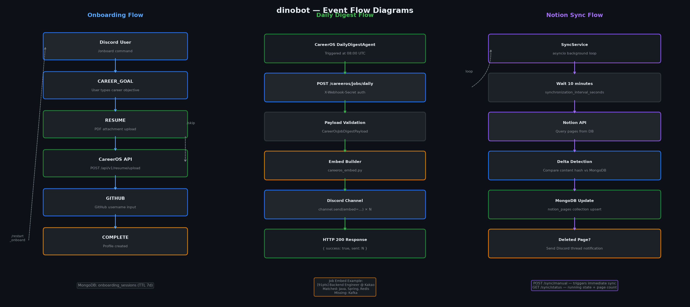

# dinobot Wiki

dinobot은 CareerOS AI 커리어 플랫폼 연동 봇이자 Notion–Discord 협업 자동화 봇이다.

## 아키텍처

## 이벤트 플로우

## 도메인 문서

| 도메인 | 설명 | 문서 |
|--------|------|------|
| Architecture | 시스템 구성 + asyncio 패턴 | [architecture.md](architecture.md) |
| CareerOS | CareerOS API 연동 클라이언트 | [careeros.md](careeros.md) |
| Onboarding | 온보딩 상태 머신 | [onboarding.md](onboarding.md) |
| Notion | Notion DB 연동 | [notion.md](notion.md) |
| Discord | 슬래시 커맨드 + Embed | [discord.md](discord.md) |
| Analytics | Prometheus 메트릭 | [analytics.md](analytics.md) |
| MCP | MCP 서버 툴 | [mcp.md](mcp.md) |

## 운영 문서

- [docs/DEPLOYMENT.md](../docs/DEPLOYMENT.md) — Fly.io 배포
- [docs/MONITORING.md](../docs/MONITORING.md) — Prometheus + Grafana
- [docs/playbooks/](../docs/playbooks/) — 인시던트 런북
- [docs/decision-log/](../docs/decision-log/) — 의사결정 로그

## ADR (Architecture Decision Records)

| ADR | 제목 |
|-----|------|
| [ADR-001](../docs/adr/ADR-001-fastapi-discord-hybrid.md) | FastAPI + Discord.py 단일 프로세스 동시 실행 |
| [ADR-002](../docs/adr/ADR-002-mongodb-conversation-state.md) | MongoDB TTL 문서로 온보딩 대화 상태 관리 |
