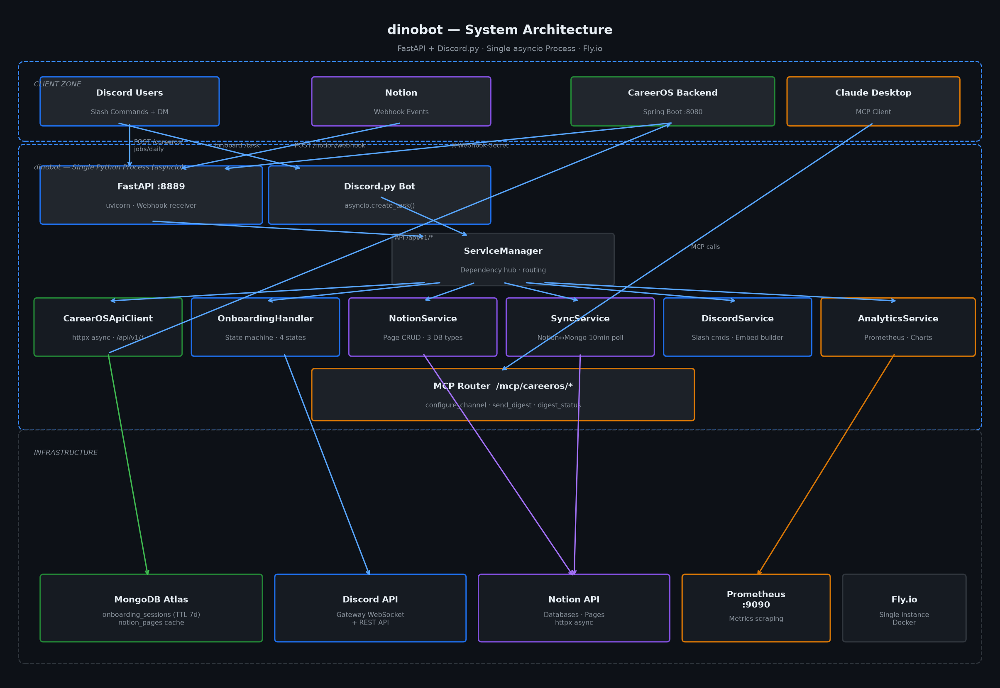

# Architecture

dinobot은 FastAPI HTTP 서버와 Discord.py 봇을 **단일 asyncio 이벤트 루프** 안에서 동시에 실행하는 설계를 채택한다.



---

## 단일 프로세스 패턴

```python
# main.py :: ServiceManager.run_service()
async def run_service(self):
    # Discord Bot → asyncio 백그라운드 태스크 (루프 비점유)
    bot_task = asyncio.create_task(
        self.discord_service.bot.start(settings.discord_token)
    )
    # FastAPI uvicorn → 메인 서버 (루프 점유)
    server = uvicorn.Server(uvicorn.Config(app=self.web_application, host="0.0.0.0", port=8889))
    await server.serve()
```

두 서비스가 동일한 이벤트 루프를 공유하므로:
- `DiscordService` 인스턴스를 FastAPI 핸들러와 Discord Bot이 메모리로 직접 공유한다.
- 단일 MongoDB Motor 연결을 모든 서비스가 재사용한다.
- IPC 없이 서비스 간 상태 전달이 가능하다.

자세한 결정 배경은 [ADR-001](../docs/adr/ADR-001-fastapi-discord-hybrid.md) 참조.

---

## ServiceManager

`src/core/service_manager.py`의 `ServiceManager`가 모든 서비스의 의존성 허브 역할을 한다.

| 메서드 | 역할 |
|--------|------|
| `initialize()` | MongoDB 연결 → 서비스 인스턴스 생성 → Discord 커맨드 등록 |
| `get_service(name)` | 이름으로 서비스 인스턴스 반환 |
| `run_service()` | asyncio 이벤트 루프 진입점 |

**초기화 순서:**
1. MongoDB Atlas 연결 (Motor)
2. NotionService, DiscordService, SyncService, CareerOSApiClient 초기화
3. `start_bot()` — 슬래시 커맨드 등록 + 이벤트 핸들러 바인딩
4. FastAPI 라우트 등록 (webhook, MCP)
5. `run_service()` → `create_task(bot.start)` + `server.serve()`

---

## 모듈 책임 테이블

| 경로 | 역할 |
|------|------|
| `main.py` | 진입점 — ServiceManager 초기화 + run_service |
| `src/core/service_manager.py` | 서비스 통합 관리자 |
| `src/service/careeros/careeros_api_client.py` | CareerOS REST API httpx 클라이언트 |
| `src/conversation/onboarding_handler.py` | 온보딩 상태 머신 메시지 라우터 |
| `src/conversation/state.py` | ConversationSession DTO + MongoDB upsert/get/delete |
| `src/conversation/file_upload_handler.py` | Discord PDF 첨부파일 → CareerOS 업로드 |
| `src/embeds/careeros_embed.py` | CareerOsJobDigestPayload → discord.Embed 변환 |
| `src/service/notion/notion_service.py` | Notion DB 페이지 CRUD |
| `src/service/sync/sync_service.py` | Notion ↔ MongoDB 10분 주기 동기화 |
| `src/service/analytics/analytics_service.py` | Prometheus 메트릭 + 통계 |
| `mcp_server/careeros_tools.py` | FastAPI MCP 라우터 `/mcp/careeros/*` |

---

## asyncio 주의사항

- Discord.py `bot.start()`는 블로킹 코루틴이므로 반드시 `asyncio.create_task()`로 분리해야 한다.
- `start_bot()`(커맨드 등록)과 `bot.start()`(Gateway 연결)은 별도 호출이다. 혼동하면 커맨드가 등록되지 않는다.
- uvicorn worker를 늘려도 Discord Bot 인스턴스는 단일 유지 — 수평 확장 시 주의.
- Discord API 오류로 `bot_task`가 종료되어도 FastAPI는 계속 동작한다. `/health` 엔드포인트에서 Bot 상태를 별도 추적해야 부분 장애를 탐지할 수 있다.

---

## 웹훅 엔드포인트

| Method | Path | 인증 | 역할 |
|--------|------|------|------|
| `POST` | `/careeros/jobs/daily` | `X-Webhook-Secret` | CareerOS 일일 다이제스트 수신 |
| `POST` | `/notion/webhook` | `X-Webhook-Secret` | Notion 변경사항 수신 |
| `GET` | `/health` | 없음 | 서비스 헬스체크 |
| `GET` | `/metrics/dashboard` | 없음 | Prometheus 실시간 대시보드 |
| `GET` | `/sync/status` | 없음 | Notion 동기화 상태 |
| `POST` | `/sync/manual` | 없음 | 수동 동기화 트리거 |
| `POST` | `/mcp/careeros/configure_channel` | — | Discord/Telegram 채널 토글 |
| `POST` | `/mcp/careeros/send_digest` | — | 온디맨드 다이제스트 트리거 |
| `GET` | `/mcp/careeros/digest_status` | — | 마지막 다이제스트 상태 |

---

## 배포 구성

```
Fly.io (단일 인스턴스)
  └── dinobot (Python 3.11, Docker)
        ├── FastAPI :8889 (uvicorn)
        └── Discord.py (asyncio background task)

MongoDB Atlas (외부 관리형)
  ├── onboarding_sessions  (TTL 7d)
  └── notion_pages         (Notion 캐시)

Prometheus :9090 (메트릭 스크래핑)
```
