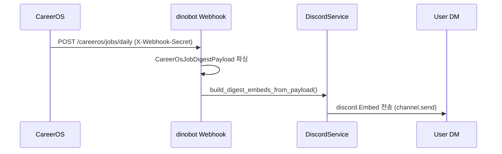

# CareerOS Integration

dinobot은 `CareerOSApiClient` (`src/service/careeros/careeros_api_client.py`)를 통해 CareerOS Spring Boot 백엔드 (`http://careeros:8080`)와 통신한다.

---

## 클라이언트 역할

`CareerOSApiClient`는 httpx 비동기 HTTP 클라이언트로 다음 역할을 담당한다:

1. **이력서 업로드** — 온보딩 중 Discord 첨부 PDF를 CareerOS에 업로드하고 `resumeId`를 반환받는다.
2. **GitHub 동기화 트리거** — 사용자의 GitHub 레포지토리 분석을 CareerOS에 요청한다.
3. **CandidateGraph 조회** — 사용자 커리어 그래프 상태를 조회한다.
4. **다이제스트 트리거/상태 조회** — 온디맨드 일일 공고 다이제스트 실행 및 마지막 실행 상태 확인.

글로벌 싱글턴: `from src.service.careeros import careeros_client`

---

## 호출 엔드포인트

| 메서드 | 경로 | 설명 | timeout |
|--------|------|------|---------|
| `POST` | `/api/v1/resume/upload` | PDF 이력서 업로드 (multipart/form-data) | 30s |
| `POST` | `/api/v1/github/sync` | GitHub 레포 분석 트리거 | 30s |
| `GET` | `/api/v1/candidate/{user_id}/graph` | CandidateGraph 상태 조회 | 15s |
| `POST` | `/api/v1/digest/trigger` | 다이제스트 온디맨드 실행 | 30s |
| `GET` | `/api/v1/digest/status` | 마지막 다이제스트 실행 메타데이터 | 15s |

---

## 인증 방식

모든 요청에 Bearer 토큰을 포함한다:

```python
headers = {
    "Content-Type": "application/json",
    "Authorization": f"Bearer {settings.careeros_api_token}",
}
```

설정 키: `CAREEROS_API_TOKEN` (환경변수 / Fly.io secret)

이력서 업로드는 multipart 요청이므로 `Content-Type`을 헤더에서 제거하고 httpx가 자동 설정한다.

---

## 에러 처리 패턴

- 모든 응답에 `resp.raise_for_status()` 적용 — HTTP 4xx/5xx는 `httpx.HTTPStatusError`로 전파.
- 호출부(온보딩 핸들러)에서 `try/except`로 사용자에게 "잠시 후 다시 시도해 주세요" 메시지를 전송.
- MCP 엔드포인트(`/mcp/careeros/send_digest`)는 `502 Bad Gateway`로 래핑해 반환.
- 타임아웃은 `httpx.AsyncClient(timeout=N)` 단위로 설정 — 이력서/GitHub sync는 30초, 조회는 15초.

---

## 웹훅 수신 (역방향)

CareerOS → dinobot 방향의 연동:

- `POST /careeros/jobs/daily` — CareerOS DailyDigestAgent가 매일 08:00 UTC에 호출.
- 인증: `X-Webhook-Secret` 헤더 검증.
- 페이로드: `CareerOsJobDigestPayload` (DTO: `src/dto/careeros/careeros_dtos.py`).
- 처리 흐름: 페이로드 파싱 → `build_digest_embeds_from_payload()` → Discord 채널 전송.

처리 흐름 요약:



자세한 통합 명세는 [docs/CAREEROS_INTEGRATION.md](../docs/CAREEROS_INTEGRATION.md) 참조.
