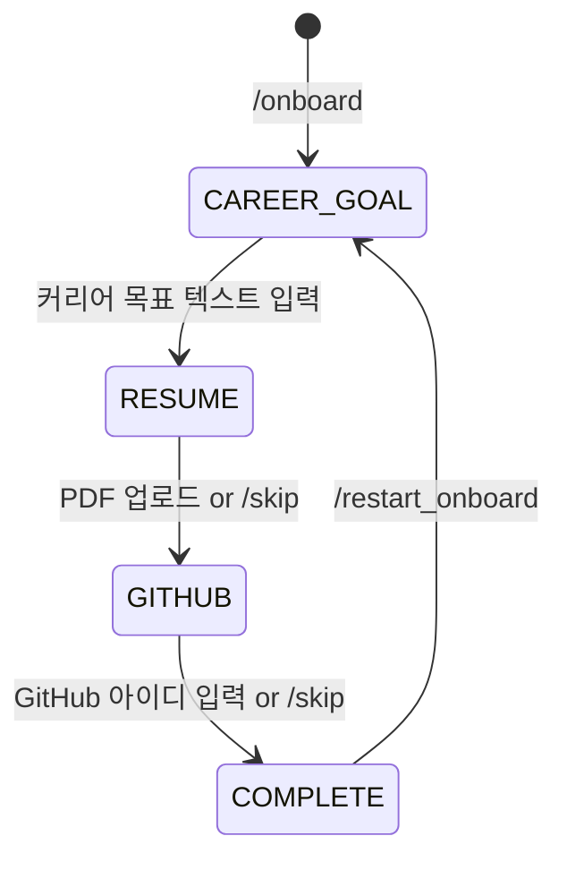

# Onboarding State Machine

Discord 온보딩은 `/onboard` 커맨드에서 시작하는 멀티스텝 대화 흐름이다. 각 단계는 MongoDB에 지속 저장되어 프로세스 재시작 후에도 복원된다.

---

## 상태 전이



| 상태 | 진입 조건 | dinobot 동작 |
|------|-----------|-------------|
| `CAREER_GOAL` | `/onboard` 실행 | "어떤 개발자가 되고 싶으신가요?" 질문 |
| `RESUME` | 목표 텍스트 수신 | `career_goal_text` 저장 후 PDF 요청 |
| `GITHUB` | PDF 업로드 or `/skip` | CareerOS에 이력서 업로드 → `resume_id` 저장 |
| `COMPLETE` | GitHub ID or `/skip` | GitHub sync 트리거 → 프로필 생성 완료 알림 |

---

## ConversationSession 필드

`src/conversation/state.py`의 `ConversationSession` 데이터클래스:

| 필드 | 타입 | 설명 |
|------|------|------|
| `channel_user_id` | `str` | Discord 사용자 ID (복합 PK) |
| `channel_type` | `DISCORD \| TELEGRAM` | 채널 타입 (복합 PK) |
| `state` | `OnboardingState` | 현재 온보딩 단계 |
| `career_goal_text` | `str?` | 사용자가 입력한 커리어 목표 |
| `resume_id` | `str?` | CareerOS 반환 resumeId |
| `github_username` | `str?` | 입력된 GitHub 아이디 |
| `careeros_user_id` | `int?` | CareerOS 사용자 ID |
| `created_at` | `datetime` | 세션 생성 시각 |
| `updated_at` | `datetime` | 마지막 업데이트 시각 |
| `expires_at` | `datetime` | TTL 만료 시각 (`updated_at + 7d`) |

복합 키 `{ channel_user_id, channel_type }`로 동일 사용자가 Discord·Telegram 각각 독립 세션을 보유할 수 있다.

---

## MongoDB TTL

컬렉션: `onboarding_sessions`

```js
db.onboarding_sessions.createIndex(
    { "expires_at": 1 },
    { expireAfterSeconds: 0 }
)
```

- `save_session()` 호출 시마다 `expires_at = updated_at + 7일`로 갱신된다. 활성 세션은 자동 연장된다.
- TTL 체크 주기는 MongoDB 기본값 약 60초이므로 만료 후 최대 1분 내 삭제된다.
- `/restart_onboard`는 `delete_session()` 후 새 세션을 생성하여 상태를 초기화한다.

자세한 결정 배경은 [ADR-002](../docs/adr/ADR-002-mongodb-conversation-state.md) 참조.

---

## 주요 명령어

| 커맨드 | 동작 |
|--------|------|
| `/onboard` | 온보딩 시작 — CAREER_GOAL 상태로 세션 생성 |
| `/skip` | 현재 단계(RESUME/GITHUB)를 건너뜀 |
| `/restart_onboard` | 기존 세션 삭제 후 CAREER_GOAL부터 재시작 |

---

## 핸들러 구조

| 파일 | 역할 |
|------|------|
| `src/conversation/onboarding_handler.py` | 메시지 라우팅 + 상태별 분기 처리 |
| `src/conversation/state.py` | ConversationSession CRUD (MongoDB) |
| `src/conversation/file_upload_handler.py` | Discord 첨부파일 다운로드 → httpx multipart → CareerOS 업로드 |
